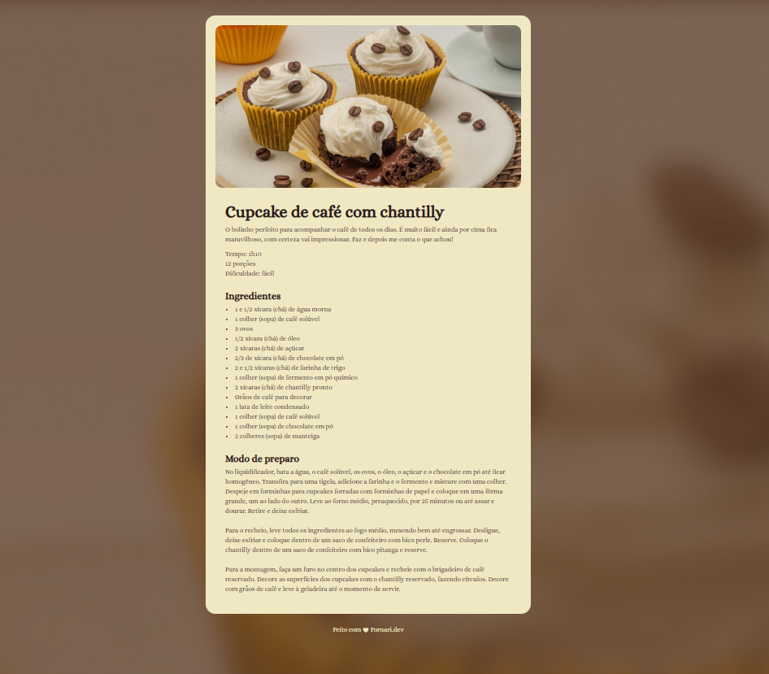

<h1 align="center"> Recipe Page </h1>

Recipe page for a coffe cupcake.  

  <a href="#-tecnologias">Tecnologias</a>&nbsp;&nbsp;&nbsp;|&nbsp;&nbsp;&nbsp;
  <a href="#-projeto">Projeto</a>&nbsp;&nbsp;&nbsp;|&nbsp;&nbsp;&nbsp;
  <a href="#-layout">Layout</a>&nbsp;&nbsp;&nbsp;

 

  

## 🚀 Tecnologias

This project was developed with the following technologies:

- HTML e CSS
- Git e Github
- Figma

## 💻 Projeto

the recipe page is a kitchen instruction manual for a coffe cupcake

- [Access the finished project online](https://gusfornari.github.io/Pagina-de-receita/)

## 🔖 Layout

Você pode visualizar o layout do projeto através [DESSE LINK](https://www.figma.com/community/file/1360315130061454535/pagina-de-receita). É necessário ter conta no [Figma](https://figma.com) para acessá-lo.

---

Feito com ♥ Fornari.dev :wave: